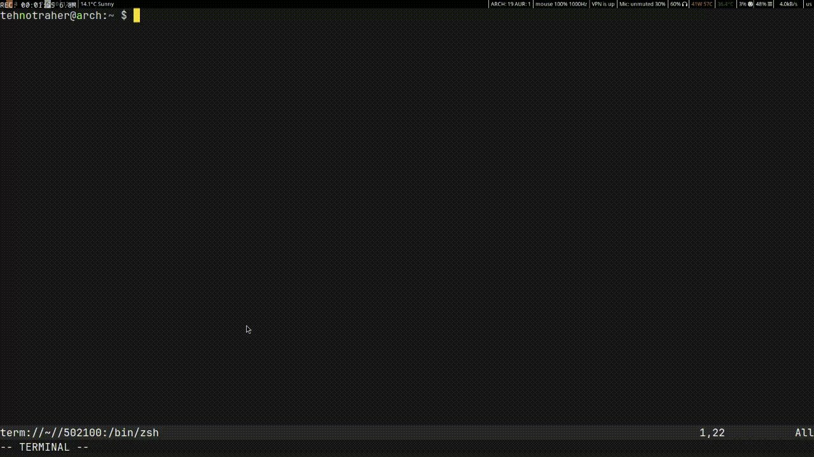

# editable-term.nvim

### This plugin allows you to edit terminal promt as if it was a regular buffer.  

Almost **every** action is supported(except for undo/redo and replace mode), even actions from plugins such as 'ds' from [nvim-surround](https://github.com/kylechui/nvim-surround)



### Requirements

The only requirement is that your shell(or REPL) must emit [OSC 133](https://gitlab.freedesktop.org/Per_Bothner/specifications/-/blob/master/proposals/semantic-prompts.md)

### Installation
via lazy.nvim
```lua
{
    'xb-bx/editable-term.nvim',
    config = true,
}
```


